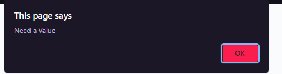

# password-generator

## Objective 
Create a password generator based on users selections such as special characters, numbers, letters, etc. 

## Screenshots
### Prompt Display 

### Prompt for no value input

### Prompts displayed for User to choose criteria for their password

### Password Generated 

Link for deployed page 
https://passwordgeneratoret.netlify.app

